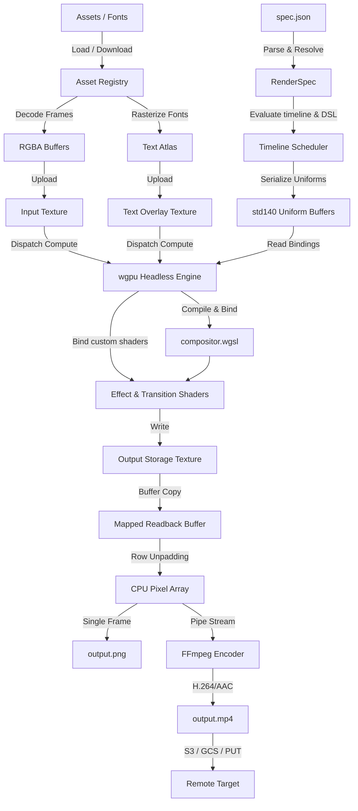

# ⚡ Render

> **A headless, GPU-accelerated video composition & rendering engine in Rust.**

[](https://github.com/google-gemini)
[](https://www.rust-lang.org/)
[-blue.svg?style=for-the-badge&logo=webgpu)](https://github.com/gfx-rs/wgpu)
[](#-disclaimer)

Render reads one declarative JSON file describing a composition — tracks, clips,
effects, text, transitions, audio — and compiles it into a PNG or an H.264/AAC
MP4. The entire timeline (compositing, blending, effects, transitions, text)
runs on the GPU through WebGPU (`wgpu`) and WGSL compute shaders.

> [!IMPORTANT]
> This repository was **vibe-coded using Gemini and Claude** as a
> high-performance proof-of-concept and educational reference. It is **not**
> intended for production use. See the [disclaimer](#-disclaimer).

---

## Contents

- [Quick Start](#quick-start)
- [Server Mode](#server-mode)
- [The Input File](#the-input-file)
- [Features](#features)
- [Architecture](#architecture)
- [Library Resolution](#library-resolution)
- [Building for AI Agents](#building-for-ai-agents)
- [Credits](#credits) · [License](#license) · [Disclaimer](#-disclaimer)

---

## Quick Start

**Prerequisites**

1. Rust toolchain (`rustc` / `cargo`, ≥ 1.75).
2. A GPU backend: Vulkan (Linux/Windows), Metal (macOS), or DX12 (Windows).
3. FFmpeg on your `PATH` (required only for `.mp4` output) — `brew install ffmpeg` / `sudo apt install ffmpeg`.

**Build & run**

```bash
git clone https://github.com/joshink/render.git
cd render
cargo build --release

# Render the bundled proof-of-concept spec → output.png
cargo run --release -- spec.json
```

**Install**

```bash
./install.sh                      # installs to ~/.local (no sudo)
./install.sh --prefix /usr/local  # system-wide
./install.sh --uninstall          # remove an installed copy
```

The installer builds the release binary, places it next to a copy of
`library/` under `$PREFIX/lib/render/`, and symlinks
`$PREFIX/bin/render` — so the installed command finds its shaders and
fonts from any directory (see [Library Resolution](#library-resolution)).

**Test**

```bash
cargo test --release   # progressive suite: filters → transitions → layout → audio → uploads
```

---

## Server Mode

`render serve` runs the engine as an HTTP service with an asynchronous job
API. Renders are long-running and GPU-bound, so `POST /render` never blocks on
the render itself: it validates the spec, enqueues a job, and immediately
returns a job id. A fixed pool of worker threads (`--concurrency`) processes
the queue.

```bash
render serve --host 127.0.0.1 --port 8080 --concurrency 1 --queue-capacity 64
```

**Outputs must be remote destinations** (`s3://`, `gs://`, `mux://`, or a
signed `http(s)://` PUT URL) — the server reports where the output landed
rather than streaming rendered bytes back. Specs with local output paths are
rejected with `422`. Credentials resolve exactly as in CLI mode: spec output
credentials, then the global CLI flags (`--aws-key`, …), then environment
variables.

| Endpoint | Description |
| --- | --- |
| `POST /render` | Submit a spec (JSON, or KDL with a `kdl` Content-Type). Returns `202` with `{id, status_url, events_url}`, or `503` when the queue is full. |
| `GET /render/{id}` | Current job status snapshot. |
| `GET /render/{id}/events` | **SSE stream** of status updates; closes after the terminal event. |
| `GET /healthz` | Liveness probe. |

```bash
# Submit a job
curl -s -X POST localhost:8080/render -H 'Content-Type: application/json' --data @spec.json
# → {"id":"…","status":"queued","status_url":"/render/…","events_url":"/render/…/events"}

# Stream progress (SSE)
curl -N localhost:8080/render/<id>/events
# data: {"status":"running","progress":{"stage":"rendering","frame":12,"total_frames":150}}
# data: {"status":"done","output":"s3://bucket/out.mp4"}
```

Job statuses: `queued` → `running` (with a `progress.stage` of
`fetching_assets`, `loading_assets`, `initializing_gpu`, `compiling_shaders`,
`rendering` (+ `frame`/`total_frames`), or `uploading`) → `done` (with
`output`) or `failed` (with `error`). For `mux://` destinations `output` is
the Mux asset id. Worker panics are caught and reported as failed jobs.

Finished jobs stay queryable for **15 minutes** after completion, then their
state is evicted from memory and `GET /render/{id}` returns `404`. An SSE
stream that is already connected is never cut off by eviction.

On `SIGTERM`/`Ctrl-C` the server stops accepting connections, finishes
in-flight renders, and fails still-queued jobs before exiting.

---

## The Input File

Everything Render does is driven by one JSON spec. A minimal example:

```json
{
  "version": "1.0",
  "output": "output.mp4",
  "composition": { "width": 1920, "height": 1080, "fps": 30, "duration": 5.0 },
  "assets": {
    "bg": { "type": "image", "path": "input.jpg" }
  },
  "tracks": [
    {
      "id": "background",
      "clips": [
        { "id": "bg_clip", "type": "media", "asset": "bg", "duration": 5.0, "scale_mode": "fill" }
      ]
    }
  ]
}
```

The same spec in [KDL](https://kdl.dev) (`version` defaults to `"1.0"`):

```kdl
composition width=1920 height=1080 fps=30 duration=5.0
output "output.mp4"

image "bg" path="input.jpg"

track "background" {
    media "bg_clip" 5.0 asset="bg" scale_mode="fill"
}
```

A spec has five top-level parts: `composition` (canvas + timing), `assets`
(named inputs), `tracks` (Z-ordered visual layers of clips), and optional
`presets` and `audio_tracks`. The output format follows the `output` file
extension.

📖 **The complete, normative schema — every field, type, default, and the
expression grammar — lives in [SPEC.md](./SPEC.md).** Each feature below links
to its section there.

✍️ **Prefer something more readable to hand-write?** Render also accepts a
[KDL](https://kdl.dev) front-end — `render timeline.kdl` transpiles to the
same spec. The same eight-line timeline drops from ~80 lines of JSON to ~15,
with comments, hex colors, and `def`/`use` reuse. See [KDL.md](./KDL.md)
(`--emit-json` shows what any `.kdl` compiles to).

---

## Features

### 🎞️ Multi-track compositing

Stack any number of tracks; index `0` is the back. Each clip composites with a
Photoshop-style `blend_mode` (`multiply`, `screen`, `overlay`, `difference`,
`hard_light`, …) and an animatable `transform` (position, scale, rotation,
opacity). Clips within a track are sequential and non-overlapping — overlay by
adding more tracks. → [Tracks](./SPEC.md#35-tracks), [Clips](./SPEC.md#36-clips)

```json
{ "id": "logo", "type": "media", "asset": "logo", "duration": 4.0, "blend_mode": "screen" }
```
```kdl
media "logo" 4.0 asset="logo" blend_mode="screen"
```

### ✨ Built-in effects

A clip's `effects` array applies filters in order. Built-ins include
`grayscale`, `brightness`, `contrast`, `saturation`, `hue_rotate`, `blur`,
`glow`, `film_grain`, `film_flicker`, `depth_blur`, and `flow`. Every parameter
is a [dynamic value](#-dynamic-expressions). → [Registered effects](./SPEC.md#51-registered-effects)

```json
"effects": [ { "type": "glow", "params": { "intensity": 1.2, "threshold": 0.4 } } ]
```
```kdl
fx { glow intensity=1.2 threshold=0.4 }
```

### 🧬 Custom WGSL shaders

~20 extra shaders ship in `library/effects/` (e.g. `chromatic_aberration`,
`crt`, `halftone`, `dithering`, `voxel`, `ink`, `pixelation`) — reference them by
file name. Drop in your own `.wgsl` and load it with `-I/--include`, or declare
it as a `shader` asset. Parameters bind by the
[custom-shader contract](./SPEC.md#7-custom-shader-parameter-contract). → [Custom shaders](./SPEC.md#53-custom-shaders)

```json
"effects": [ { "type": "crt", "params": { "scanlineIntensity": 0.4, "barrelDistortion": 0.2 } } ]
```
```kdl
fx { crt scanlineIntensity=0.4 barrelDistortion=0.2 }
```

### 🎨 Color LUTs

Drop a `.cube` (Adobe/DaVinci Resolve, 1D or 3D) or HALD CLUT image into
`library/luts/`, declare it as a `lut` asset, and apply it with the built-in
`lut` effect. The LUT is uploaded as a strip atlas and sampled with trilinear
interpolation; `amount` blends between the original and graded image.

```json
"assets": { "teal_orange": { "type": "lut", "path": "luts/teal_orange.cube" } },
"effects": [ { "type": "lut", "params": { "lut": "teal_orange", "amount": 0.8 } } ]
```
```kdl
lut "teal_orange" path="luts/teal_orange.cube"        // asset
fx { lut lut="teal_orange" amount=0.8 }               // clip effect
```

### 🔀 Transitions

Cross-blend adjacent clips on a track. Built-ins: `fade`, `wipe`, `flash_burn`
(exposure flash + film burn-in), `focus_in` (defocus/refocus with lens breathing),
and `slide_switch` (35 mm projector swap). → [Transitions](./SPEC.md#39-transitions)

```json
"transitions": [ { "id": "t1", "type": "fade", "from": "a", "to": "b", "duration": 1.0 } ]
```
```kdl
fade "t1" from="a" to="b" dur=1.0                     // inside the track
```

### 📐 Structured text layout

Compose text with UI-style stacks — `vstack`, `hstack`, `zstack`, and `spacer`,
with `alignment`, `spacing`, and `padding`. → [Text](./SPEC.md#312-text), [Layout nodes](./SPEC.md#312a-layout-nodes)

```json
"text_params": {
  "kind": "layout",
  "body": { "type": "vstack", "spacing": 12.0, "children": [
    { "type": "text", "text": "CREATIVE", "font": "title_font", "font_size": 64.0 }
  ] }
}
```
```kdl
text "headline" 5.0 {
    vstack spacing=12 {
        text "CREATIVE" font="title_font" size=64
    }
}
```

### ✍️ Variable fonts

Text is rasterized with `swash`, with full OpenType variation-axis support. Drive
any axis (`wght`, `wdth`, `slnt`, …) with a constant, keyframes, or an
expression — so weight or width can animate over time. The bundled font is
`library/fonts/Inter-VF.ttf`. → [Text](./SPEC.md#312-text)

```json
"axes": { "wght": { "expression": "300.0 + 400.0 * (0.5 + 0.5 * sin(clip_time * 3.0))" } }
```
```kdl
axes wght=(expr)"300.0 + 400.0 * (0.5 + 0.5 * sin(clip_time * 3.0))"
```

### 🎬 Text animation

`entrance` / `exit` transitions animate glyphs in and out, staggered per
`letter`, `word`, or `line`, from a `start_transform` (offset, scale, rotation,
opacity). → [Text transitions](./SPEC.md#312b-text-transitions)

```json
"entrance": { "type": "rise", "granularity": "letter", "delay": 0.05, "duration": 0.6,
  "start_transform": { "position_offset": [0.0, 40.0], "opacity": 0.0 } }
```
```kdl
enter "rise" granularity="letter" delay=0.05 dur=0.6 {
    from opacity=0.0 { offset 0 40 }
}
```

### 🎚️ Dynamic expressions

Any numeric property accepts a math expression evaluated per frame, with
variables `time`, `clip_time`, `clip.duration`, `comp.width`, and `comp.height`,
the constant `pi`, and functions `sin cos tan abs sqrt pow min max clamp`. →
[Expression DSL](./SPEC.md#43-expression-dsl)

```json
"position": { "expression": "[comp.width * 0.5 + 50.0 * sin(clip_time * 2.0), comp.height * 0.5]" }
```
```kdl
position (expr)"[comp.width * 0.5 + 50.0 * sin(clip_time * 2.0), comp.height * 0.5]"
```

### 📈 Keyframing

Or animate by keyframes, interpolated with `linear`, `ease_in`, `ease_out`,
`ease_in_out`, or a custom cubic-bézier `[x1, y1, x2, y2]`. → [Dynamic values](./SPEC.md#4-dynamic-values)

```json
"opacity": [
  { "time": 0.0, "value": 0.0, "easing": "ease_out" },
  { "time": 1.0, "value": 1.0 }
]
```
```kdl
opacity {
    key 0.0 0.0 ease="ease_out"
    key 1.0 1.0
}
```

### 🧩 Presets

Define reusable, parameterised effect bundles once and reference them by name,
substituting arguments with `$input`. → [Presets](./SPEC.md#310-presets)

### 🔊 Audio mixing

`audio_tracks` mix audio (and video soundtracks) in parallel with the visuals;
clips support `trim_start` and per-clip offsets, muxed via FFmpeg at unity gain.
→ [Audio tracks](./SPEC.md#311-audio-tracks)

### ☁️ Remote assets & cloud upload

Any asset `path` may be an `https://` URL — it's downloaded and cached
automatically (the cache is capped at 10 GiB, least-recently-used entries
evicted first; override with `RENDER_CACHE_MAX_BYTES`). The `output` may
target the local disk, `s3://`, `gs://`, a signed `https://` PUT URL, or
`mux://` (uploaded straight to [Mux Video](https://mux.com) via its Direct
Uploads API), with credentials from the spec, CLI flags, or environment.
A failed FFmpeg encode fails the render — nothing is uploaded and the CLI
exits non-zero. → [Output](./SPEC.md#32-output), [Assets](./SPEC.md#34-assets)

### ⚙️ CLI overrides

Override any spec field at the command line without editing JSON — handy for
batch rendering. → [CLI](./SPEC.md#2-command-line-interface)

```bash
render spec.json --width 1280 --height 720 --fps 60 -o out/720p.mp4
render spec.json --set composition.duration=10.0
```

### 🔬 Debug suite

`--debug <dir>` writes a timestamped run folder with a full `logs.txt`, a
machine-readable `review.json`, and spot-check PNGs captured at clip boundaries,
transitions, and effect events. → [Debug layout](./SPEC.md#62-debug-run-layout)

```bash
cargo run --release -- spec.json --debug ./debug
```

---

## Architecture

From JSON parse to GPU dispatch to FFmpeg encode:



---

## Library Resolution

Because Rust binaries don't bundle external directories, the installed `render`
command resolves the `library/` folder (compositor shader, effect/transition
shaders, fonts) at runtime, in this order:

1. **`RENDER_LIBRARY_PATH`** — if set, used directly:
   ```bash
   export RENDER_LIBRARY_PATH="/absolute/path/to/render/library"
   ```
2. **`./library`** in the current working directory.
3. **Executable-relative** — walking up from the binary's location.

> [!WARNING]
> Running a bare copied binary from another directory without
> `RENDER_LIBRARY_PATH` set will fail to load the compositor shader and fonts.
> Installs made with [`./install.sh`](#quick-start) are not affected: the
> binary lives next to a copy of `library/`, so executable-relative
> resolution (rule 3) always finds it.

Full details, including per-asset path resolution, are in
[SPEC.md §2.5](./SPEC.md#25-library--asset-resolution).

---

## Building for AI Agents

This project was vibe-coded with Gemini and Claude. To keep that workflow going,
[Agents.md](./Agents.md) is an onboarding guide for AI coding agents: it covers
hardware memory boundaries (e.g. `wgpu::COPY_BYTES_PER_ROW_ALIGNMENT` unpadding),
WGSL `std140` alignment, and the tech-stack roadmap. **If you are an AI
assistant working here, read it before writing code.**

---

## Credits

Several effect and transition shaders were adapted from or inspired by
[basementstudio/shader-lab](https://github.com/basementstudio/shader-lab).

## License

MIT — see [LICENSE](./LICENSE).

## ⚖️ Disclaimer

This repository is **for educational purposes only**: a proof-of-concept for
headless GPU video composition. It is not optimized or audited for production
workloads, long-running memory behaviour, or the security of untrusted custom
WGSL shaders. Use at your own risk.
