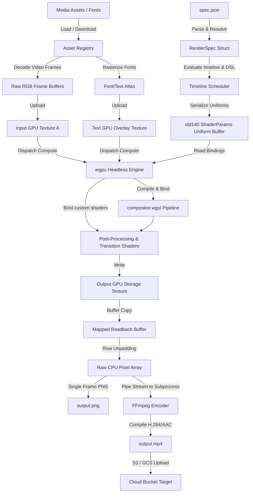

# ⚡ Render

> **A Headless, GPU-Accelerated Video Composition & Rendering Engine in Rust**

[](https://github.com/google-gemini)
[](https://www.rust-lang.org/)
[-blue.svg?style=for-the-badge&logo=webgpu)](https://github.com/gfx-rs/wgpu)
[](#disclaimer)

---

> [!IMPORTANT]
> **Vibe-Coding Pedigree & Educational Disclaimer**
> This repository was completely **vibe-coded using Gemini and Claude** under human guidance. It is designed as a high-performance **Proof-of-Concept (PoC)** and an educational reference for headless GPU video processing using Rust and WebGPU. It is **not** intended for stable production systems.

---

## 📖 Table of Contents
- [Project Overview](#project-overview)
- [Key Features](#key-features)
- [System Architecture](#system-architecture)
- [Getting Started](#getting-started)
  - [Prerequisites](#prerequisites)
  - [Installation](#installation)
  - [Running the PoC](#running-the-poc)
  - [Running Tests](#running-tests)
- [Configuration Specification (`spec.json`)](#configuration-specification-specjson)
- [Shader Libraries](#shader-libraries)
  - [Effects Catalog](#effects-catalog)
  - [Transitions Catalog](#transitions-catalog)
- [Dynamic Expressions & Keyframing](#dynamic-expressions--keyframing)
- [AI-Agent Native Development](#ai-agent-native-development)
- [Disclaimer](#disclaimer)

---

## 🔍 Project Overview

**Render** is a headless rendering utility that parses a declarative composition schema (represented as JSON) and compiles it into high-fidelity image sequences or compressed video streams. 

Rather than executing compositing and visual filters on the CPU, **Render** offloads the entire timeline evaluation, layout formatting, multi-track blending, effect styling, and transition processing directly onto the GPU using **WebGPU (`wgpu`)** and **WGSL compute pipelines**. This eliminates unnecessary CPU-GPU memory bus transfers, pipeline stalls, and CPU overhead.

---

## ✨ Key Features

*   **⚡ Headless GPU Rendering:** Full orchestration of WebGPU textures, bind groups, and pipelines on headless environments (using Metal, Vulkan, or DirectX 12).
*   **🎞️ Multi-Track Visual Compositor:** Composites layered Z-ordered tracks with support for standard Photoshop blending modes (`multiply`, `screen`, `overlay`, `difference`, `hard_light`, etc.).
*   **🧬 Extensible Shader Pipelines:** A library of 29+ modular WGSL post-processing effects and 5+ optics-based transitions. Easily integrate custom `.wgsl` shaders.
*   **📐 Structured Layout Engine:** Nest clips and elements using alignment constraints resembling modern UI frameworks (supporting `vstack`, `hstack`, `zstack`, and `spacer` blocks).
*   **✍️ Dynamic Type & Variable Axes:** Integrates the `swash` layout engine for font rasterization with full support for OpenType variation axes (e.g. animating font weight/width dynamically over time).
*   **🎚️ Mathematical Expression DSL:** Animates any scalar or vector property (positions, scale, opacity, custom shader parameters) on a per-frame basis using a math expression parser (`evalexpr`).
*   **📈 Advanced Keyframing:** Custom cubic-bezier and standard easing curves (`ease_in`, `ease_out`, `ease_in_out`, `linear`) mapping property variables over time.
*   **☁️ Cloud Native Asset Resolution:** Built-in loaders for fetching remote resources (assets, images, videos, fonts) over HTTPS.
*   **📤 Cloud Target Uploads:** Directly uploads compiled outputs (videos, images) to S3, Google Cloud Storage (GCS), or signed PUT URLs, integrating with standard IAM credentials and environment variables.
*   **🔬 Diagnostic Debug Suite:** Runs with `--debug` to output timestamped run folders containing execution logs (`logs.txt`), metadata summaries (`review.json`), and diagnostic keyframe spot-checks.

---

## 🏗️ System Architecture

The following diagram illustrates the lifecycle of a composition, from schema parsing to GPU dispatch and FFmpeg encoding.



---

## 🚀 Getting Started

### Prerequisites

To build and run the rendering engine, ensure you have:
1. **Rust Toolchain:** `rustc` and `cargo` installed (minimum version 1.75).
2. **GPU Drivers:** Vulkan (Linux/Windows), Metal (macOS), or DX12 (Windows).
3. **FFmpeg:** Installed on your system path (required for compiling `.mp4` video outputs).
   - *macOS:* `brew install ffmpeg`
   - *Linux:* `sudo apt install ffmpeg`

### Installation

Clone the repository and compile the project in release mode:

```bash
git clone https://github.com/joshink/render.git
cd render
cargo build --release
```

### Running the PoC

Execute the binary on the default proof-of-concept spec. This loads the test input image `input.jpg`, applies a grayscale color conversion and brightness boost via compute shaders, and saves the output to `output.png`:

```bash
cargo run --release -- spec.json
```

### Running Tests

The project features a progressive integration test suite that tests everything from simple filters to multi-clip transitions, layout calculations, audio mixes, and S3-compatible cloud uploads. Run all tests via the test orchestrator:

```bash
chmod +x run_tests.sh
./run_tests.sh
```

---

## 📝 Configuration Specification (`spec.json`)

Compositions are defined using a declarative JSON spec. Below is a sample showcasing layout, tracks, visual effects, and transitions:

```json
{
  "version": "1.0",
  "output": "output.mp4",
  "composition": {
    "width": 1920,
    "height": 1080,
    "fps": 30,
    "duration": 5.0
  },
  "assets": {
    "bg_image": {
      "type": "image",
      "path": "input.jpg"
    },
    "custom_font": {
      "type": "font",
      "provider": "file",
      "path": "fonts/GT-Canon-VF.ttf"
    }
  },
  "tracks": [
    {
      "id": "background_track",
      "clips": [
        {
          "id": "bg_clip",
          "type": "media",
          "asset": "bg_image",
          "duration": 5.0,
          "scale_mode": "fill",
          "effects": [
            {
              "type": "chromatic_aberration",
              "params": {
                "offset": { "expression": "[10.0 * sin(clip_time * 2.0), 0.0]" }
              }
            }
          ]
        }
      ]
    },
    {
      "id": "text_overlay_track",
      "clips": [
        {
          "id": "title_text",
          "type": "text",
          "duration": 5.0,
          "text_params": {
            "kind": "layout",
            "body": {
              "type": "vstack",
              "spacing": 12.0,
              "children": [
                {
                  "type": "text",
                  "text": "CREATIVE COMPOSITION",
                  "font": "custom_font",
                  "font_size": 64.0,
                  "color": [1.0, 1.0, 1.0, 1.0],
                  "axes": {
                    "wght": { "expression": "300.0 + 400.0 * (0.5 + 0.5 * sin(clip_time * 3.0))" }
                  }
                }
              ]
            }
          },
          "transform": {
            "position": { "expression": "[comp.width * 0.5, comp.height * 0.5]" },
            "opacity": [
              { "time": 0.0, "value": 0.0, "easing": "ease_out" },
              { "time": 1.0, "value": 1.0 },
              { "time": 4.0, "value": 1.0, "easing": "ease_in" },
              { "time": 5.0, "value": 0.0 }
            ]
          }
        }
      ]
    }
  ]
}
```

Detailed documentation of all CLI arguments, schemas, and exit codes can be found in the [External Interface Specification (SPEC.md)](file:///Users/joshink/Development/render/SPEC.md).

---

## 🎨 Shader Libraries

Modular WGSL files are dynamically parsed and bundled by the compiler at runtime. They are located inside the `library/` directory.

### Effects Catalog (`library/effects/`)
| Shader | Description | Key Parameters |
| :--- | :--- | :--- |
| `bloom.wgsl` | Simulates high-intensity light bleed. | `intensity`, `threshold` |
| `blur.wgsl` | Performs multi-sample Gaussian blur. | `radius` |
| `crt.wgsl` | Emulates CRT phosphors, scanlines, and screen curvature. | `bend`, `scanline_opacity` |
| `dithering.wgsl` | Performs classic retro color quantization and error diffusion. | `colors`, `scale` |
| `edge_detect.wgsl` | Sobel-filter edge outline highlighter. | `thickness`, `color` |
| `film_grain.wgsl` | Emulates retro film organic noise. | `amount`, `speed` |
| `fluted_glass.wgsl` | Refracts light through fluted glass textures. | `scale`, `refraction` |
| `halftone.wgsl` | Converts the screen into CMYK/Grayscale print dots. | `dot_size`, `angle` |
| `chromatic_aberration.wgsl` | Red/Green/Blue color fringe offsets. | `offset` (vec2) |
| `voxel.wgsl` | Downsamples the texture to render 3D-like pixels. | `size` |

### Transitions Catalog (`library/transitions/`)
| Shader | Description | Key Parameters |
| :--- | :--- | :--- |
| `fade.wgsl` | Linear opacity cross-fade. | (N/A) |
| `wipe.wgsl` | Left-to-right directional wipe with customizable softness. | `softness` |
| `flash_burn.wgsl` | Overexposes exposure and burns edges using noise. | `flash_intensity`, `burn_intensity` |
| `focus_in.wgsl` | Animates focus blur breathing and camera lens zoom. | `max_blur` |
| `slide_switch.wgsl` | Mechanical 35mm projector slide swap with snap bounce. | `direction`, `gap_size`, `flicker` |

---

## 🧮 Dynamic Expressions & Keyframing

Any numeric configuration supports polymorphic input:

1.  **Constants:** Simple floating-point values: `1.2`.
2.  **Keyframe interpolation:** Interpolates values between timestamps using pre-defined easing curves.
    ```json
    "opacity": [
      { "time": 0.0, "value": 0.0, "easing": "ease_out" },
      { "time": 1.5, "value": 1.0 }
    ]
    ```
    Easing supports `"linear"`, `"ease_in"`, `"ease_out"`, `"ease_in_out"`, or a custom cubic bezier array `[x1, y1, x2, y2]`.
3.  **Expressions:** Parses mathematical formulas evaluated dynamically on the GPU per frame. Available variables include:
    *   `time`: The absolute timeline timestamp.
    *   `clip_time`: The timestamp relative to the current clip's start.
    *   `clip.duration`: The duration of the clip.
    *   `comp.width` / `comp.height`: Resolution dimensions.

---

## 🤖 AI-Agent Native Development

This project was built from scratch using a **Vibe Coding** process powered by Google Gemini and Anthropic Claude. To preserve and scale this collaborative model, the repository contains a developer guide specifically structured for subsequent AI coding agents:

*   **[AGENTS.md](file:///Users/joshink/Development/render/Agents.md):** The official onboarding guide. It details hardware-level memory boundaries (e.g., `wgpu::COPY_BYTES_PER_ROW_ALIGNMENT` unpadding algorithms), WGSL `std140` memory alignment constraints, and tech stack roadmaps.
*   **Agent Guidelines:** If you are an AI assistant working on this codebase, always read `AGENTS.md` before writing code.

---

## 🙏 Credits & Acknowledgments

Some of the post-processing effects and transition shaders in the `library/` directory were adapted or inspired by the excellent work in [basementstudio/shader-lab](https://github.com/basementstudio/shader-lab). 

---

## 📄 License

This project is licensed under the MIT License. See the [LICENSE](file:///Users/joshink/Development/render/LICENSE) file for details.

---

## ⚖️ Disclaimer

This repository is **for educational purposes only**. It is a proof-of-concept demonstrating headless GPU video composition. It is **not** optimized or audited for production workloads, memory leaks under continuous use, or security vulnerabilities in untrusted custom WGSL shaders. Use at your own risk.
