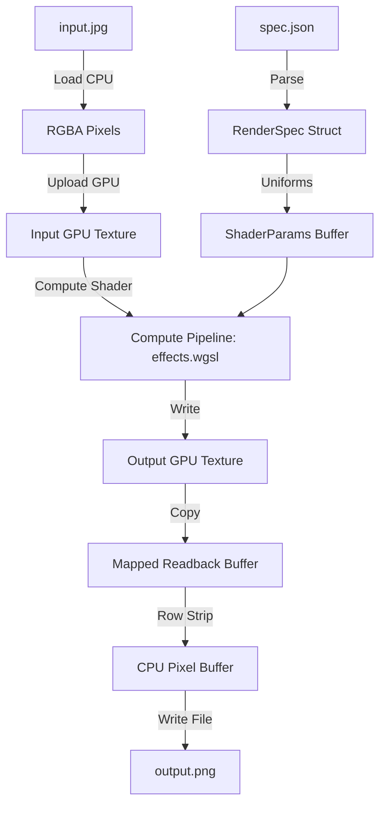

# Render

Render is a high-performance, headless GPU-accelerated video rendering engine written in Rust. It interprets declarative scripts (represented as JSON or a custom DSL) and compiles them into processed media outputs.

The core rendering engine is built on **WebGPU (`wgpu`)**, enabling portable compute and render shader execution (using WGSL/GLSL) on headless servers via Vulkan, Metal, or DirectX 12.

## Project Vision
- **Speed:** Offload all decoding, compositing, visual filters, and encoding pipelines directly to the GPU, minimizing CPU-GPU memory bus transfers.
- **Capabilities:** If an effect or transition can be expressed in a shader (WGSL), it can be rendered dynamically in the timeline.
- **Extensibility:** A plug-and-play plugin system using traits (interfaces) to easily implement new transition effects, color filters, and dynamic keyframe expressions.

---

## Getting Started

### Prerequisites
- **Rust Toolchain:** (Cargo, rustc >= 1.75)
- **GPU Driver Backends:** Vulkan (Linux), Metal (macOS), or DirectX 12 (Windows)

### Running the Proof of Concept (PoC)
The current PoC validates the headless WebGPU pipeline by reading a JSON spec, loading an image, executing a WGSL compute shader, reading back the texture, and exporting the result.

1. Create a `spec.json` file in the project root:
   ```json
   {
     "width": 800,
     "height": 800,
     "input": "input.jpg",
     "output": "output.png",
     "effects": [
       { "effect_type": "grayscale" },
       { "effect_type": "brightness", "params": { "factor": 1.3 } }
     ]
   }
   ```
2. Place a test image at `input.jpg`.
3. Run the compiler and engine:
   ```bash
   cargo run
   ```
4. Verify the output image is generated at `output.png`.

---

## Engine Architecture


